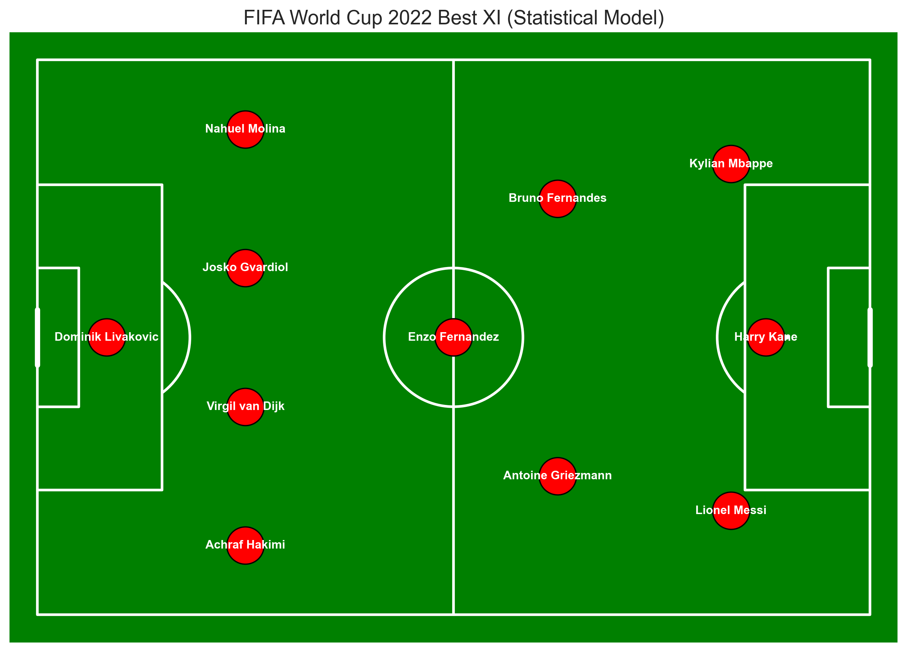
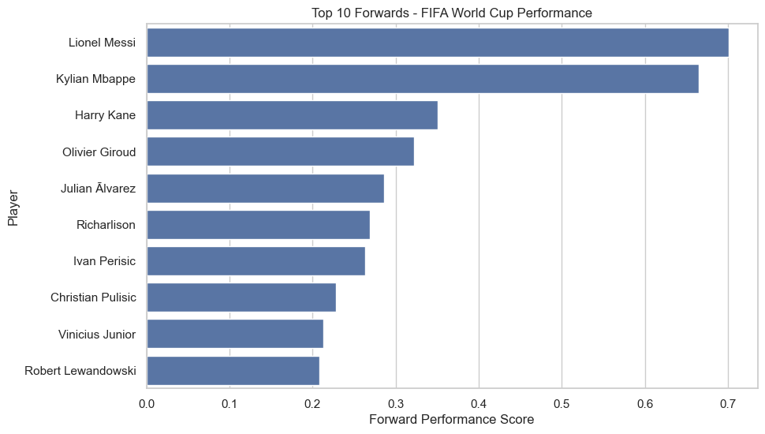

# ⚽ FIFA World Cup 2022 Best XI – Data Analytics Project

##📊 A data-driven approach to selecting the Best XI from FIFA World Cup 2022 using statistical modeling and performance analytics.

## 📌 Project Overview

This project builds a **data-driven Best XI team** from the FIFA World Cup 2022 using statistical modeling and performance analysis.

Instead of subjective selection, players are evaluated using **position-specific metrics**, normalized data, and a weighted scoring system to ensure fair comparison across roles.

---

## 🎯 Objective

* Identify the **top-performing players** in each position
* Build a **statistical model** for player evaluation
* Generate a **Best XI squad (4-3-3 formation)**
* Visualize insights using **data analytics techniques**

---

## 🧠 Methodology

### 1. Data Processing

* Separate datasets for:

  * Forwards
  * Midfielders
  * Defenders
  * Goalkeepers
* Cleaned missing values using median imputation
* Filtered players based on **minimum playing time (270+ minutes)**

---

### 2. Feature Engineering

Used **per-90 metrics** for fair comparison:

* Goals per 90
* Assists per 90
* Expected Goals (xG)
* Expected Assists (xA)
* Tackles, Clearances, Passes, Saves

---

### 3. Statistical Model

Each position has a **custom weighted scoring model**:

#### Example (Forward Score):

```
Forward Score =
0.30 × goals_per90 +
0.20 × assists_per90 +
0.25 × npxg_per90 +
0.15 × xg_assist_per90 +
0.10 × goals_assists_per90
```

---

### 4. Model Improvements

* ✅ **Normalization (MinMaxScaler)** to balance metric scales
* ✅ **Minutes-based reliability factor** to reduce bias from small samples
* ✅ **Discipline penalty** (yellow/red cards)
* ✅ Position-aware evaluation

---

## 🏆 Best XI Selection

Formation used:

```
4-3-3
```

* 1 Goalkeeper
* 4 Defenders
* 3 Midfielders
* 3 Forwards

Players are selected based on **highest final score per position**.

---

## 📊 Visualizations

### 🔹 Ranking Charts

* Top 10 Forwards
* Top 10 Midfielders
* Top 10 Defenders
* Top 10 Goalkeepers

### 🔹 Analytical Visuals

* Goals vs Expected Goals (xG)
* Midfielder Quadrant Analysis
* Defender Quadrant Analysis
* Goalkeeper Performance Comparison

### 🔹 Tactical Visualization

* Best XI Formation plotted on a football pitch

---

## 🖼 Sample Outputs

### Best XI Formation



### Example Analysis



---

## 🛠 Tech Stack

* Python
* Pandas
* NumPy
* Matplotlib
* Seaborn
* mplsoccer
* Scikit-learn

---

## 📁 Project Structure

```
fifa-worldcup-bestXI/
│
├── data/
├── notebooks/
├── visuals/
├── results/
├── src/
└── README.md
```

---

## 🚀 Key Insights

* Players with high **xG and finishing efficiency** dominate forward rankings
* Midfielders require a **balance of creativity, passing, and defense**
* Defensive metrics must include **both tackles and clearances**
* Goalkeeper performance depends on **efficiency, not just volume of saves**

---

## 📌 Future Improvements

* Add **Radar Charts for player comparison**
* Build an **interactive dashboard (Power BI / Tableau)**
* Include **team-level analysis**
* Use **machine learning models for player ranking**

---

## 👨‍💻 Author

**Utsab Raj Acharya**

---

## ⭐ Conclusion

This project demonstrates how **data analytics can be applied to sports** to make objective decisions, replacing subjective opinions with statistical insights.

---
